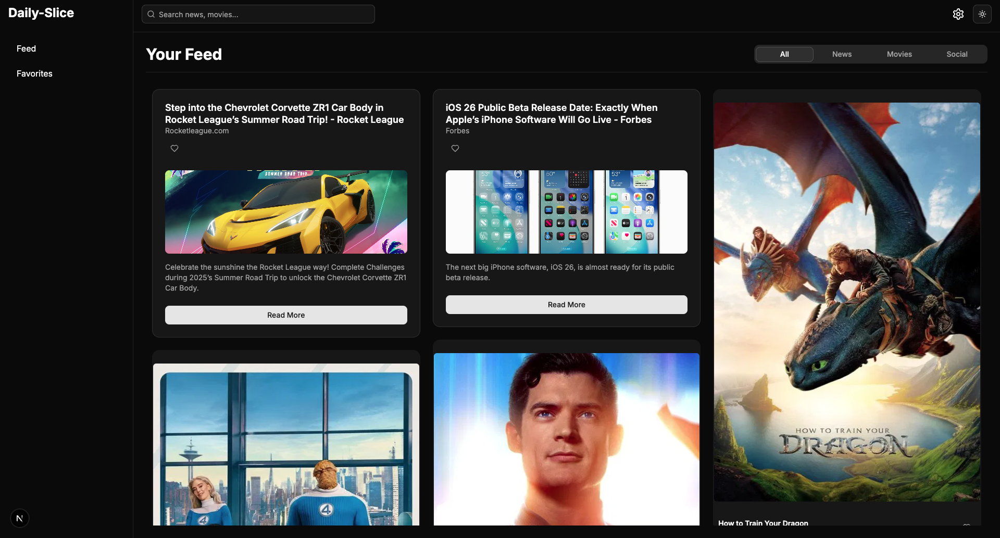
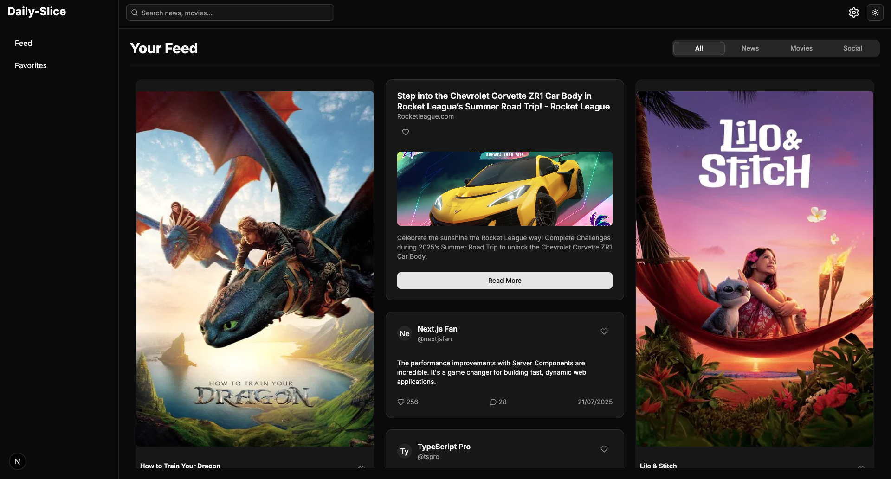
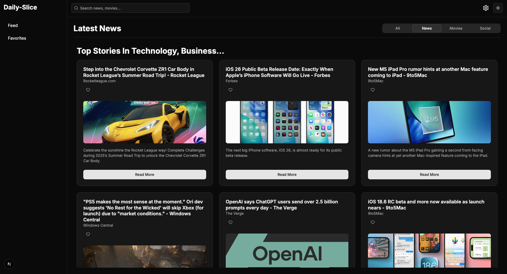
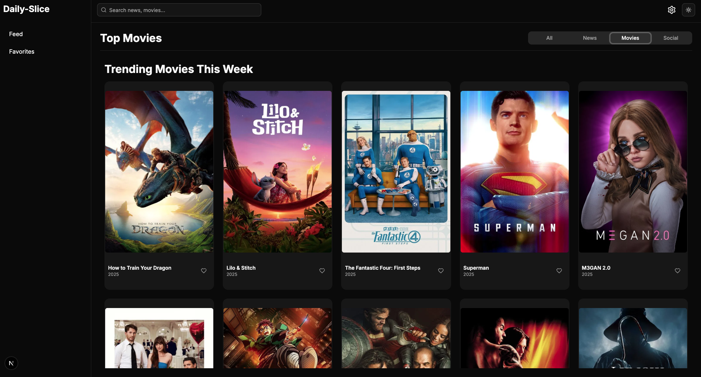
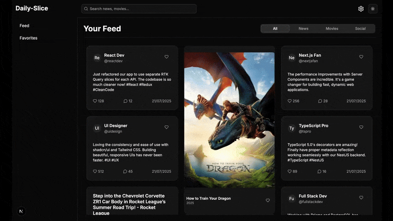
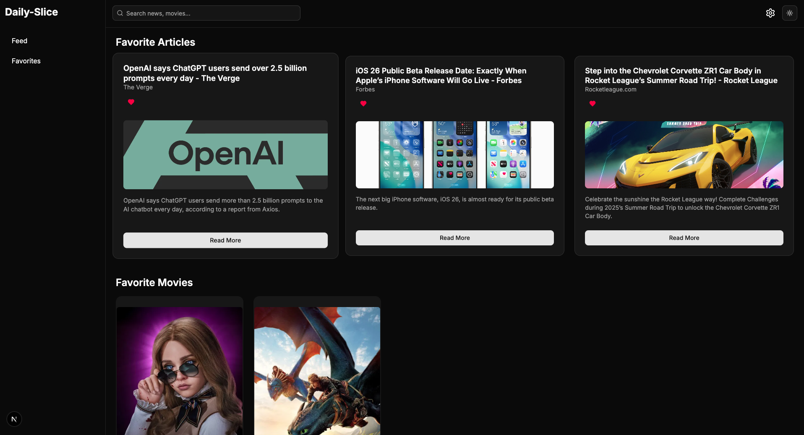
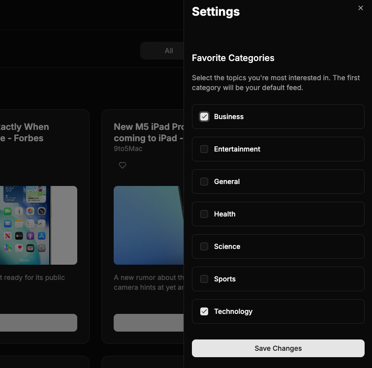

# DAILY-SLICE - Personalized Content Dashboard

A dynamic, user-centric dashboard that aggregates news, movie recommendations, and social content into a unified, interactive, and endlessly scrollable feed.

**Live Demo:** [Click to Visit](https://daily-slice-omega.vercel.app/)

---


*A preview of the main dashboard.*

## Features

- **Personalized Feeds:** Content is tailored based on user-set preferences.
- **Multi-Source Aggregation:** Fetches data from three distinct sources (NewsAPI, TMDB API, Mock Social API).
- **Tabbed Layout:** Cleanly organizes content by type (All, News, Movies, Social).
- **Infinite Scrolling:** Feeds for news and movies automatically load more content as the user scrolls.
- **Debounced Quick Search:** A highly responsive search bar with a "quick search" dropdown and a dedicated, tabbed results page.
- **Recent Search History:** The search bar remembers and displays recent queries using `localStorage`.
- **Favorites System:** Users can save any piece of content and view it on a dedicated, organized Favorites page.
- **Context-Aware Settings Panel:** A slide-out panel that shows relevant settings for the currently viewed content tab.
- **Dark Mode:** A sleek, modern dark mode with a theme toggle.
- **Responsive Design:** A fully responsive layout that works on all screen sizes.
- **Testing:** Comprehensive test coverage including:
    - **Unit Tests** (Jest) for core logic.
    - **Integration Tests** (React Testing Library) for component-Redux interactions.
    - **End-to-End Tests** (Playwright) for critical user journeys.

## Showcase

### Main Dashboard (Tabbed View - FeedTab)

### Main Dashboard (Tabbed View - NewsTab)

### Main Dashboard (Tabbed View - MoviesTab)


### Search in Action (Quick Search & Results Page)


### Favorites Page


### Settings Panel


---

## Tech Stack

- **Framework:** Next.js 14 (App Router)
- **Language:** TypeScript
- **Styling:** Tailwind CSS
- **UI Components:** shadcn/ui
- **State Management:** Redux Toolkit & RTK Query
- **Animation:** Framer Motion
- **Testing:** Jest, React Testing Library, Playwright

---


## Running the Project Locally

1.  **Clone the repository:**
    <br>

    Clone this repo

2.  **Install dependencies:**
    ```bash
    npm install
    ```
3.  **Set up environment variables:**
    Create a `.env.local` file in the root of the project and add your API keys:
    ```
    NEXT_PUBLIC_NEWS_API_KEY=YOUR_NEWS_API_KEY
    NEXT_PUBLIC_TMDB_API_KEY=YOUR_TMDB_API_KEY
    ```
4.  **Run the development server:**
    ```bash
    npm run dev
    ```
5.  **Run tests:**
    ```bash
    npm test
    npm run test:watch
    npx playwright test
    ```


### **Project Checklist: Daily Slice**

### **Phase 1: Project Setup & Foundation 🏗️**

- [x]  Initialize Next.js project with TypeScript & Tailwind
- [x]  Integrate `shadcn/ui`
- [x]  Install core dependencies (`@reduxjs/toolkit`, `react-redux`, `lucide-react`)
- [x]  Set up Redux store (`store.ts`, `uiSlice.ts`, `StoreProvider.tsx`)
- [x]  Apply Redux Provider in the root layout
- [x]  Configure environment variables (`.env.local`)

---

### **Phase 2: UI Layout & Static Components 🎨**

- [x]  Build the responsive `MainLayout.tsx` component
- [x]  Use `shadcn/ui Sheet` for the responsive mobile sidebar
- [x]  Use `next/link` for all internal navigation
- [x]  Add necessary `shadcn/ui` components (Card, Button, etc.)
- [x]  Create a flexible `ContentCard.tsx` component
- [x]  Implement the `ThemeToggle` component and connect it to Redux

---

### **Phase 3: State Management & API Integration ⚙️**

- [x]  Set up RTK Query (`apiSlice.ts`) and integrate it into the Redux store
- [x]  Create a `preferencesSlice.ts` for user categories
- [x]  Fetch data from the first API (e.g., News API) using an RTK Query hook
- [x]  Display loading states (e.g., spinners or skeletons)
- [x]  Display error states gracefully
- [x]  Render dynamic data using the `ContentCard` component

---

### **Phase 4: Implementing Core Features ✨**

- [x]  Build a settings panel to update user preferences in Redux
- [x]  Create a `favoritesSlice.ts` to manage favorited content
- [x]  Add "favorite" functionality to the `ContentCard`
- [x]  Create a `/favorites` page to display favorited items
- [x]  Integrate a second API (e.g., TMDB for movies)
- [x]  Integrate a mock social media feed
- [x]  Combine all data sources into a single, unified feed

---

### **Phase 5: Advanced Features & Refinement 🚀**

- [x]  Implement a debounced search bar
- [x]  Implement infinite scrolling or pagination
- [ ] Add drag-and-drop reordering for content cards (`react-dnd` or `framer-motion`)
- [x]  Add subtle UI animations and transitions

---

### **Phase 6: Testing 🧪**

- [x]  Write unit tests for Redux slices and utility functions
- [x]  Write integration tests for key components
- [x]  Set up an E2E testing framework (Playwright)
- [x]  Write E2E tests for critical user flows (search, favorites, etc.)

---

### **Phase 7: Finalization & Submission ✅**

- [x]  Perform final code cleanup and add documentation comments
- [x]  Write a comprehensive `README.md` file
- []  Deploy the application to a hosting service (e.g., Vercel)
- [ ]  Record a demo video of the application
- [ ]  Review all submission guidelines one last time

